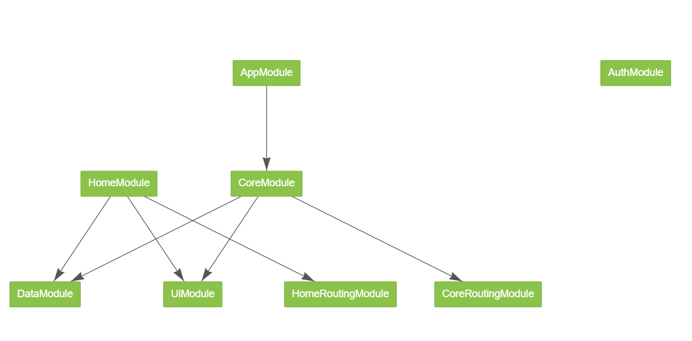
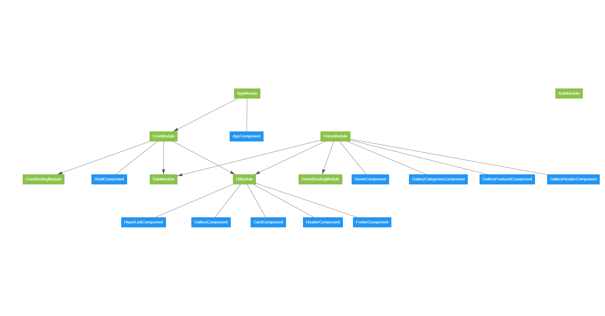

# 1 Nx, grandes proyectos requieren mejores herramientas

## Instalación y configuración de Nx

- Tema: [Instalación y migración de aplicaciones para usar con Nx](https://www.notion.so/albr/Angular-Escalable-ef905bb0b90846b2ac423ed35c276a6e#7c09b824b7694d46b71bf8e2fb97bfbf)

- Pull Request: [1-style-Configure-Names-and-Prefixes PR: #2](https://github.com/angularbuilders/angular.builders/pull/2)

Aunque el repositorio se llama `Angular.Builders` se usa como prefijo `ab` por ser más corto complementado con el nombre de la _app_ o _lib_ que corresponda.

En este caso `"prefix": "ab-showcase",` tanto en `angular.json` como en `apps\showcase\.eslintrc.json`

---

## Estructura de soluciones: aplicaciones y librerías

- Tema: [Instalación y migración de aplicaciones para usar con Nx](https://www.notion.so/albr/Angular-Escalable-ef905bb0b90846b2ac423ed35c276a6e#59b96283feaa4cf78e6f364b2a7d1b61)

- Pull Request: [refactor-Aplicaciones-Librerías-y-módulos PR: #4](https://github.com/angularbuilders/angular.builders/pull/4)

### 📘 Core Module

Módulo destinado a enrutado a dependencias de otros módulos y al componente shell

`ng g m core --project=showcase --routing --routingScope=Root`

### 📚 UI Lib

Librería especializada en componentes reutilizables entre aplicaciones.

`ng g @nrwl/angular:library --name=ui --buildable --enableIvy --linter=eslint --prefix=ab-ui --strict`

### 📚 Data Lib

Librería especializada en servicios de acceso remoto y gestión local de datos

`ng g @nrwl/angular:library --name=data --buildable --enableIvy --linter=eslint --prefix=ab-data --strict`

### 📚 Auth Lib

Librería especializada en temas de seguridad, con servicios, componentes y rutas

> 🚨 Esta librería gestiona rutas de carga diferida. ¡Y puede usarse en distintos proyectos! Ojo al `parent module`

`ng g @nrwl/angular:library --name=auth --buildable --enableIvy --lazy --linter=eslint --parentModule=apps\showcase\src\app\core\core-routing.module.ts --prefix=ab-auth --routing `



---

## Nx ecosystem jest, cypress, storybook

- Tema: [Ecosistema y utilidades de Nx (Cypress, Jest, StoryBook)](https://www.notion.so/albr/Angular-Escalable-ef905bb0b90846b2ac423ed35c276a6e#79bae06e6976489992b18594daf62b62)

- Pull Request: [test-Nx-ecosystem-jest-cypress-storybook PR: #6](https://github.com/angularbuilders/angular.builders/pull/6)

### Pruebas unitarias

#### Jest

Configurado de serie. 💡 Se sugiere deshabilitar para componentes presentacionales.

### Pruebas funcionales

### 🐲 StoryBook

Permite probar componentes presentacionales de manera unitaria

`npm i -D @nrwl/storybook`

#### 📚 UI Lib

Configurado para probar la interacción de sus componentes con _storybook_

`ng g @nrwl/angular:storybook-configuration --name=ui --no-configureCypress --no-generateCypressSpecs --generateStories`

### 🌲 Cypress

Permite probar aplicaciones funcionando (e2e) o librerías que expongan rutas.

#### 📚 Auth Lib

Configurado para probar las páginas (rutas) con _cypress_

`ng g @nrwl/angular:storybook-configuration --name=auth --configureCypress --generateCypressSpecs --generateStories`

---

### 💂‍♂️ Modo estricto

En el `tsconfig.base.json` puedes activar el modo estricto tanto para TypeScript como para Angular. Con ello tendrás que ser más riguroso en la declaración y uso de tipos, pero a cambio ganarás en confianza por los chequeos extra de ambos compiladores.

```json
""compilerOptions": {
  "strict": true,
  }
"angularCompilerOptions": {
    "strictTemplates": true,
    "strictInjectionParameters": true
  },
```

---

# 2. Components

## Tipos de componentes y su equivalente en (Atomic Design)

- Tema: [Tipos de componentes y responsabilidades](https://www.notion.so/albr/Angular-Escalable-ef905bb0b90846b2ac423ed35c276a6e#10474f6487fe4625879c56e0271829c8)

- Pull Request: [7-feat-Componentes-tipos-y-sistemas #8]https://github.com/angularbuilders/angular.builders/pull/8)

### En módulos funcionales

- Normalmente asociados a rutas cargadas en modo lazy.

- Pueden residir en su propia librería

Si es así se aconseja configurar su generación para que por defecto sean privados.

```json
  "schematics": {
    "@schematics/angular:component": {
      "export": "false",
    }
  }
```

#### Componentes de ruta (PAGES)

Son componentes inteligentes con responsabilidad de llamada a lógica de negocio y accesos a datos. Se auto generan con su módulo _lazy_

`ng g m --name=routes/home --module=core/core.module --route=home --routing --no-interactive`

> No deben contener HTML standard en su plantilla

#### Componentes de negocio (ORGANISMS)

Son componentes presentacionales con responsabilidad de lógica de presentación y validación.

`ng g c --name=routes/home/gallery-header --skipTests`

`ng g c --name=routes/home/gallery-categories --skipTests`

`ng g c --name=routes/home/gallery-featured --skipTests`

> Reciben datos síncronos vía @Input y emiten eventos mediante @Output. Pueden necesitar pruebas unitarias de código para validaciones o transformaciones.

### En módulos de infraestructura

- Son compartidos por el resto de módulos.

- Suelen residir en su propia librería (UI).

- Publica sus propias interfaces de datos.

- No suelen requerir constructor ni _ngOnInit_

Si es así se aconseja configurar su generación para que por defecto sean exportables y sin pruebas de código.

```json
  "schematics": {
    "@schematics/angular:component": {
      "export": "true",
      "skipTests": "true"
    }
  }
```

#### Plantillas de páginas (TEMPLATES)

Componentes con _placeholders_ para incrustar otros componentes aportando consistencia y reutilizando _layouts_

`ng g c --name=templates/gallery --project=ui --export --skipTests`

> Hacen uso extenso de la directiva `ng-content`.

#### Plantillas de páginas (MOLECULES)

Similares a los organismos, pero más abstractos. No están adaptados a un problema de negocio concreto; resuelven problemas comunes a cualquier aplicación.

`ng g c --name=molecules/card --project=ui --export --skipTests`

> Presentan al usuario estructuras de datos genéricas.

#### Plantillas de páginas (ATOMS)

Nivel mínimo de componentización. Encapsulan elementos de HTML estándar o de algún framework CSS. De esta forma hacen que la aplicación sea menos dependiente de terceros.

`ng g c --name=atoms/hyperLink --project=ui --export --skipTests`

> Normalmente aportan también su granito de arena en la homogeneidad UX.



---

## Estrategias de detección de cambios

### 🤹‍♀️ Default

Detección automática. Transparente para el programador pero se lanza demasiadas veces y con evaluación por valor (costosa con objetos o arrays grandes).

### 🥊 OnPush

Detección semiautomática. El programador es consciente de cuándo y porqué se lanza pero ocurre menos veces y con evaluación por referencia (mucho más rápida).

Se recomienda configurarlo para todas las aplicaciones en `angular.json`.

```json
  "schematics": {
    "@schematics/angular:component": {
      "change-detection": "OnPush"
    }
  }
```

> 🦉 Como regla general es mejor exponer objetos que tipos primitivos (_avoid primitive obsession_). Pero esto implica usar alguna técnica de **inmutabilidad** y enviar clones para cada cambio.
